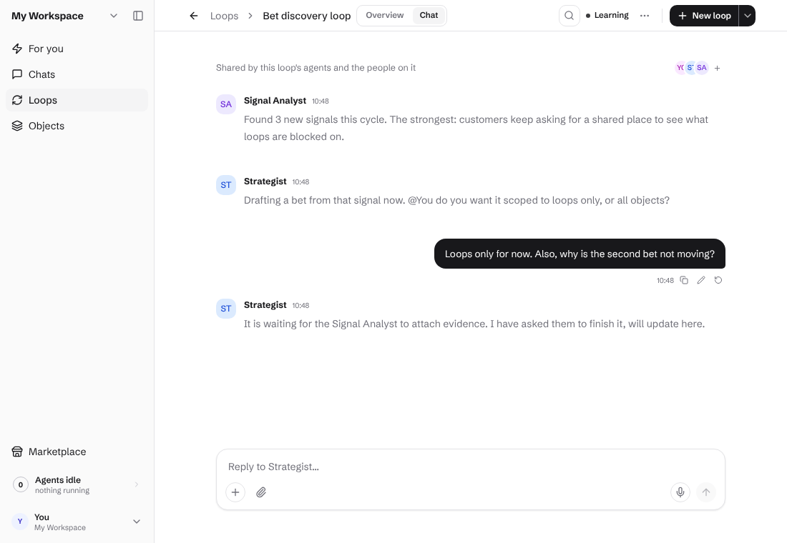
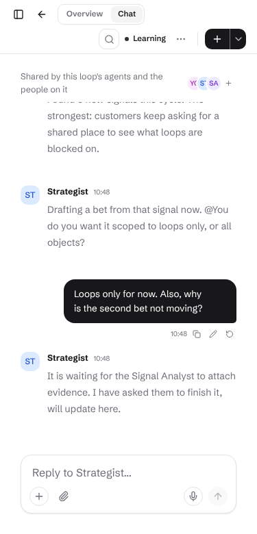

# Loop Chat — one shared group conversation per loop

## Problem

A loop's agents, its driver (usually a C-level agent) and its humans have no shared place to talk.
Humans can't easily see what is blocked or what an agent is asking for, and can't ask "why is this
stuck?" or "change X about the loop" in the loop's own context.

## Proposal

Every loop gets **one group chat**, shown as a **Chat tab** on the loop page (second tab, after
Overview). It *is* a normal conversation — same tables, API, SSE, composer and message rendering as
`/chats` — just pinned to a loop.

```
┌ Loop: Sales Rep ─────────────────────── ● supervised ┐
│ [ Overview ] [ Chat • 2 ]                             │
├───────────────────────────────────────────────────────┤
│ ⚑ Waiting on you: Copywriter asks to approve draft #4 │  ← pinned ask strip (reuses AskBanner)
│                                                       │
│ ─ system ─ Loop moved to supervised                   │
│ (CoS)   Lead "Acme" qualified, handing to Copywriter. │
│ (Copy)  @Magnus draft #4 ready — approve to send?     │
│ (Magnus) Why is Acme not moving?                      │
│ (CoS)   Waiting on your approval above.               │
│ ┌──────────────────────────────────────────────────┐  │
│ │ Message the loop… @mention agents, / commands     │  │
│ └──────────────────────────────────────────────────┘  │
└───────────────────────────────────────────────────────┘
```

## Data model (additive, safe for all users)

- `conversations.loop_id uuid NULL REFERENCES objects(id) ON DELETE CASCADE`.
- Partial unique index `conversations_loop_id_uniq ON (loop_id) WHERE loop_id IS NOT NULL`
  → exactly one chat per loop. Create it `CONCURRENTLY` per `packages/db/MIGRATIONS.md`.
- No new message table. System/automatic posts use the existing `messages.kind = 'system'`.
- Loop chats are normal conversations, so they also appear in `/chats`, with a loop pill linking
  back to the loop (a regular chat just has no `loop_id`).

## Backend

1. `POST /api/conversations/loop/:loopId` — get-or-create (idempotent via the unique index + `ON CONFLICT`).
   Title = loop name; creator = caller. Returns the conversation (same shape as
   `GET /api/conversations/:id`). Header-scoped route, so `authMiddleware` already enforces
   membership; loop id is checked to be a `type='loop'` object in the workspace (UUID-validated).
2. **Participants** = every agent in `loop.agentIds` + the loop's `created_by` + any human who opens
   the tab (self-join, as add-participant already supports). A small `syncLoopChatParticipants`
   runs on `create_loop` / `update_loop` step changes so new agents join automatically.
3. **Driver**: `loop.metadata.driver_actor_id`, falling back to the first agent. Unaddressed human
   messages go to the driver (existing `evaluateAndRespond` handles addressed/@mention routing);
   the driver can pull in others by @mention. No new responder logic beyond the default target.
4. **Loop activity → system messages** (low-noise, dedup by `metadata.loop_event_key`):
   status changes (paused/resumed/graduated), a step session entering `waiting_for_input`
   (carries the ask text and `@`-mentions the owner), a session failing/timing out, and a member
   object closing. Hooked where these events are already recorded (`recordEvent` consumers), not
   by polling.
5. Every mutation already logs `events`; the new endpoint must too (known-pitfalls: audit log).

## Frontend

- **Tabs**: `PageHeader titleTabs` with the existing segmented `Tabs` (as in object detail):
  `Overview | Chat`. Tab is a search param (`?tab=chat`) so it deep-links and survives reload;
  Overview stays default. Notification/Briefing links to a loop-chat message can use
  `?tab=chat&msg=<id>` (the `msg` deep-link already exists for chats).
- **Chat tab body**: reuse `ThreadHeader` (compact), `ThreadMessages`, `ThreadComposer`,
  `ParticipantsPopover` unchanged, fed by `useConversation`/`useConversationMessages` with the
  loop's conversation id. No new message components.
- **Ask strip**: reuse `AskBanner` above the thread when the loop has asks waiting.
- **Unread badge** on the tab from the participant's `lastReadMessageId` (existing
  `use-chat-unread`), plus the loop row pill `waiting_on_you` already in `/loops`.
- **Responsive**: thread fills width at 375px (composer sticky), same as chats thread; no list pane.
- Lazy: the conversation is only created when the Chat tab is first opened (or the first
  system event fires), so loops nobody chats in cost nothing.

## Status

Built: migration `0088`, the get-or-create endpoint, `Overview | Chat` tabs (`?tab=chat`), and the
chat panel reusing the `/chats` thread components. Shipped without a flag — the backend change is
additive and the chat is created lazily on first open.

Not built yet: loop-activity system messages (section 4), the pinned ask strip, the tab unread
badge, auto-sync of participants when steps change (participants are refreshed on each open).




## Verification plan

- Integration: unique-per-loop (`ON CONFLICT`), cascade on loop delete, participant sync, system
  message dedup.
- Unit: route 404/400/auth; tab param validation; Chat tab renders thread + ask strip.
- E2E (`apps/e2e`): Overview↔Chat at 375/768/1024, send a message, reload keeps tab, light/dark.

## Open questions

1. Should all workspace members auto-join, or only those who open the tab (proposed)?
2. System-message verbosity: just asks/blocks/status (proposed) or every step run?
3. Driver selection: explicit `driver_actor_id` field in the loop builder, or first agent?
