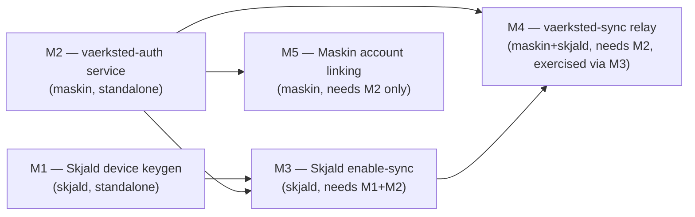

# Vaerksted Auth & Sync — Implementation Plan (M1–M5)

Status: Proposal, not yet implemented
Owner: Magnus
Companion to: [`vaerksted-auth-and-sync.md`](./vaerksted-auth-and-sync.md) — read that first; this doc assumes it

## Context

`vaerksted-auth-and-sync.md` is an approved design (all open decisions in it are dated 2026-08-08 and marked "Decided"). This plan turns its six milestones into concrete engineering work across the two repos involved — `maskin` (Hono/Drizzle/Postgres monorepo) and `skjald` (Tauri/Rust + Next.js, sibling directory, its own repo) — through M5 (M6/agent principals stays explicitly out of scope per the doc's non-goals).

Two codebases, so two convention sets apply throughout: Maskin's `CLAUDE.md` + `.claude/rules/*` (Drizzle migrations, Vitest/Playwright gates, Biome, `events` audit-log-on-mutation, `turbo.json` env passthrough) and Skjald's `CLAUDE.md` (Tauri command/event pattern, sqlx migrations under `frontend/src-tauri/migrations/`, `AppState` composition). Nothing here overrides those — it cites the specific rule where it applies.

This plan does not re-derive the *why* behind any decision already settled in the design doc — it only cites the relevant section (`§5`, `§6a`, etc.) and moves straight to *what to build*.

## Cross-cutting technical decisions (not fully pinned in the design doc)

The design doc deliberately leaves some implementation choices open. This plan pins them so milestones can be built without re-litigating:

| Decision | Choice | Reasoning |
|---|---|---|
| vaerksted-auth/-sync service framework | Hono + `@hono/node-server`, scaffolded from `apps/agent-server` (not `apps/dev` — no OpenAPI/full-CRUD needed) | Matches Maskin's stack; `apps/agent-server` is already the minimal-standalone-Hono-service template in this repo |
| vaerksted-auth/-sync DB access | Own Drizzle schema + own migration folder **inside each app** (`apps/vaerksted-auth/src/db/`), not a shared `packages/` library | Design doc §4 requires zero code-level dependency from Maskin into vaerksted internals; a `packages/*` lib would need Dockerfile COPY-list wiring (`known-pitfalls.md`) for no benefit since only one app ever imports it |
| Where vaerksted-auth's Postgres lives | The already-created dedicated Supabase project's own Postgres (not a new/third DB) | That Supabase project already bundles Postgres + GoTrue — reusing it for `vaerksted_identity`/`device`/`device_cert` avoids provisioning a second database for the same service |
| Where vaerksted-sync's Postgres lives | Same Supabase project, separate Postgres **schema** (`vaerksted_sync`), separate migration folder | "Own Postgres schema" per §10; avoids a third Supabase project while keeping migrations independent per service |
| Ed25519 crypto (TS side) | `@noble/curves` (pure JS, no native bindings) | Native bindings (e.g. libsodium) risk the `import.meta.url`/esbuild-bundling pitfall already documented in `known-pitfalls.md`; pure JS sidesteps it entirely |
| Ed25519 crypto (Rust side) | `ed25519-dalek` + `rand_core` | Standard, audited, already the de facto choice for this exact use case |
| Device private-key storage (desktop) | `keyring` crate (wraps macOS Keychain / Windows Credential Manager / Linux Secret Service) | First OS-keychain usage in Skjald (confirmed greenfield) — `keyring` is the standard cross-platform abstraction |
| Device private-key storage (iOS) | Needs a spike in M1 — `keyring`'s iOS support (Security-framework-backed) must be verified against Skjald's actual iOS build before relying on it | Skjald's iOS port is real and in progress (`skjald/CLAUDE.md`); don't assume desktop tooling ports cleanly without checking |
| WS transport (vaerksted-sync server) | `@hono/node-ws` | Keeps the WS server inside the same Hono app/routing instead of a second HTTP server; first WS usage in this monorepo (confirmed — everything today is SSE via `packages/realtime`) |
| WS transport (Skjald client) | `tokio-tungstenite` | First WS client dependency in Skjald (confirmed absent from `Cargo.toml`); pairs naturally with the existing `tokio` async runtime |
| Cert-verification shared code between vaerksted-auth and vaerksted-sync | New `packages/vaerksted-crypto` (Ed25519 keygen/sign/verify, cert issue/verify, nonce generation), imported by **both** vaerksted apps only | Design doc's "no code-level dependency" constraint is about Maskin/Skjald not depending on vaerksted internals — it says nothing against the two vaerksted services sharing crypto code with each other, and duplicating signature-verification logic is a correctness risk not worth taking |

## M1 — Skjald local device identity

**Repo:** `skjald`. **Ships independently, no server exists yet** (per design doc).

- New Rust module `skjald/frontend/src-tauri/src/identity/` (`mod.rs`, `keypair.rs`, `commands.rs`), following the existing module shape (compare `webhooks/`, `local_api/`).
- `keypair.rs`: generate an Ed25519 keypair (`ed25519-dalek`) on first run if none exists; store the private key via the `keyring` crate under a fixed service/account (e.g. service `skjald`, account `device-identity`); this never touches SQLite or leaves the device.
- New sqlx migration (`frontend/src-tauri/migrations/<timestamp>_device_identity.sql`) for a local `device_identity(device_id TEXT PRIMARY KEY, public_key TEXT NOT NULL, platform TEXT NOT NULL, created_at TEXT NOT NULL)` table — stores the *public* key + generated `device_id` (uuid) only; mirrors the existing `meetings`/`transcripts` migration style.
- New repository `database/repositories/identity.rs` (mirrors `meeting.rs`/`setting.rs` conventions) for the `device_identity` row.
- New Tauri commands in `identity/commands.rs`: `get_device_identity` (returns `{device_id, public_key, platform}`, generating on first call if absent) — **no network call**, registered in `lib.rs`'s `generate_handler!` list per the documented "Adding a New Tauri Command" pattern.
- **Spike task**: verify `keyring` crate behavior when cross-compiled for `aarch64-apple-ios` (per `skjald/CLAUDE.md`'s iOS build notes — cross-compilation surprises are the norm there, e.g. build-script host-vs-target issues). If it doesn't work, fall back to `security-framework` crate directly against the iOS Keychain API.
- **Invariant to enforce from day one** (design doc §6, "hard rule, not just today's default"): nothing added in M1 gates any existing recording/transcription/local-storage Tauri command on identity state. `get_device_identity` is purely additive.

## M2 — vaerksted-auth service

**Repo:** `maskin`, new app `apps/vaerksted-auth`. **No product surface yet beyond a test client** (per design doc).

**Scaffolding** (mirrors `apps/agent-server`):
- `apps/vaerksted-auth/package.json` — `dev`/`build`/`start`/`test`/`type-check` scripts; deps: `@hono/node-server`, `hono`, `zod`, `drizzle-orm`, `postgres`, `@supabase/supabase-js`, `packages/vaerksted-crypto` (workspace:*)
- `apps/vaerksted-auth/build.mjs` — copy `apps/agent-server/build.mjs`'s esbuild pattern
- `apps/vaerksted-auth/tsconfig.json` — extends root
- `apps/vaerksted-auth/src/index.ts`, `src/routes/`, `src/db/schema.ts`, `src/db/drizzle.config.ts`, `src/lib/`

**Schema** (`src/db/schema.ts`, own migration folder under `apps/vaerksted-auth/drizzle/`) — exactly the three tables from design doc §5: `vaerksted_identity`, `device`, `device_cert`. Follow Maskin's Drizzle conventions (see `packages/db/src/schema.ts` for the house style: `uuid().defaultRandom().primaryKey()`, `timestamp({withTimezone: true}).defaultNow()`) even though this is a separate schema/package.

**New shared package** `packages/vaerksted-crypto/` (see cross-cutting decisions table): `generateKeypair()`, `signChallenge()`, `verifyChallenge()`, `issueCert()`, `verifyCert()`. Unit-tested in isolation (`packages/vaerksted-crypto/src/__tests__/`).

**Routes** (`apps/vaerksted-auth/src/routes/`), implementing design doc §6 steps 2–5 and §6a:
- `POST /identities` — new identity via Supabase Auth (magic link / Google / Microsoft OAuth per §6a priority order); on success, upsert `vaerksted_identity` keyed by `supabase_user_id`.
- `POST /sessions` — existing identity login; same Supabase Auth verification, look up existing `vaerksted_identity`, issue a short-lived vaerksted-auth session token (JWT signed with a service-owned key, distinct from the device-cert signing key).
- `POST /devices` — session-authenticated; body `{public_key, platform, display_name}`; insert `device` row, call `vaerksted-crypto`'s `issueCert()`, insert+return `device_cert`.
- `POST /devices/:id/revoke` — session or device-cert authenticated; sets `device.revoked_at`.
- `POST /auth/challenge` — issues a nonce for challenge-response (§6 step 4).

**Middleware** `src/lib/session-middleware.ts` and `src/lib/device-cert-middleware.ts` — mirror the *shape* of `packages/auth`'s `createMiddleware`/`c.set(...)` pattern (do not import `packages/auth` itself — no code-level dependency allowed).

**MFA step-up** (§6a): `POST /devices` must re-check MFA freshness once MFA exists — stub this as a TODO/feature-flagged no-op for M2 (MFA is explicitly "Later" in §6a's priority order), but leave the hook point in the route so M2 doesn't need revisiting when MFA lands.

**OAuth2.1 posture** (§6a): only relevant once vaerksted-auth becomes an *issuer* (§11 M6 territory) — no action needed in M2 beyond not building anything that would need retrofitting (i.e., don't implement implicit grant or ROPC anywhere).

**Env vars** (add to `turbo.json` `globalPassThroughEnv`, per the recurring pitfall in `known-pitfalls.md`/`structural-verification.md`): `VAERKSTED_AUTH_DATABASE_URL`, `SUPABASE_URL`, `SUPABASE_SERVICE_ROLE_KEY`, `VAERKSTED_AUTH_SIGNING_PRIVATE_KEY`, `VAERKSTED_AUTH_SESSION_JWT_SECRET`.

**Testing**: Vitest unit tests for routes (self-contained mock-DB harness, since this app has no `packages/db` dependency to reuse — write a small local equivalent of `setup.ts`'s `mockResults` pattern). Integration tests against the real Supabase Postgres for the cert-issuance and revocation-propagation paths (per `.claude/rules/verification.md`'s "any DB-writing route/service needs an integration test" rule, applied to this app's own `__tests__/integration/`).

**Deployment**: new `apps/vaerksted-auth/Dockerfile` (own image, don't fold into `apps/dev/Dockerfile`); add as a new service in `docker-compose.prod.yml` (own env block, no host port, Traefik/Coolify routes it — same shape as the existing `app` service).

## M3 — Skjald "Enable sync" flow

**Repo:** `skjald`. **Wires M1 to M2, single-device only — no relay yet** (per design doc, proves the handshake end-to-end).

- New Rust module `skjald/frontend/src-tauri/src/sync/` (or extend `identity/`): `enable_sync` command that drives design doc §6 steps 2–3.
- OAuth/magic-link UI: reuse the existing one-shot local-HTTP-listener OAuth callback pattern already implemented in `calendar/oauth.rs` for Google/Microsoft Calendar — same shape (open system browser via Tauri's opener, listen on loopback for the redirect, exchange code) applies directly to vaerksted-auth-mediated Google/Microsoft OAuth.
- New sqlx migration: local `device_cert(device_id TEXT PRIMARY KEY, identity_id TEXT, cert_json TEXT, expires_at TEXT)` cache table, plus repository.
- **Open decision to resolve during this milestone** (not settled by the design doc): whether to retain Supabase's refresh token in the OS keychain to allow *silent* cert renewal, vs. strictly following §6's "password/session token is not retained" and requiring full re-login every TTL window. The doc's invariant only protects *local* functionality from being gated — it doesn't mandate zero token retention beyond the device cert. Recommend retaining the refresh token (keychain-stored, same protection level as the device private key) so offline-heavy users (a core Skjald scenario per §12) aren't forced to re-auth every 24h; flag this explicitly as a deviation-with-reason in the PR description when implemented.
- Frontend (`frontend/src/`): new "Enable sync" settings UI — follow the existing Sidebar/settings component conventions already in the codebase; call the new Tauri commands via `invoke`.
- Cert renewal: background task (spawned in `lib.rs` setup, similar lifecycle to existing background workers like `webhooks/delivery_worker.rs`) that checks `device_cert.expires_at` and renews before expiry using the retained refresh token.

## M4 — vaerksted-sync relay

**Repo:** `maskin` (new app `apps/vaerksted-sync`) + `skjald` (new sync client). **This is what makes two Skjald devices actually sync** (per design doc) — the largest milestone.

### Server: `apps/vaerksted-sync`

Scaffolded identically to `apps/vaerksted-auth` (Hono + `@hono/node-server`, own `build.mjs`/`tsconfig.json`).

- Schema (own migration folder, `vaerksted_sync` Postgres schema): `sync_blob(id, device_id, identity_id, meeting_id, field, logical_clock, payload, created_at, delivered_at nullable)` implementing the per-field LWW model from §9 keyed by `(device_id, logical_clock)`.
- Routes: `POST /sync/push` (blob + metadata), `GET /sync/pull?since=<clock>` (reconnect/catch-up).
- WS endpoint (`@hono/node-ws`, per cross-cutting decision) for fan-out to online devices; retains undelivered blobs for offline devices until acknowledged.
- Auth: **no network call back to vaerksted-auth per request.** Device certs are self-contained and signed by vaerksted-auth's Ed25519 signing key — vaerksted-sync verifies them locally using `packages/vaerksted-crypto`'s `verifyCert()` plus `VAERKSTED_AUTH_PUBLIC_KEY` (env var, the public half of vaerksted-auth's signing key). This matches §9's "it authenticates callers via device certs from vaerksted-auth — it does not run its own login flow" and keeps the relay's hot path free of a synchronous cross-service dependency.
- **No E2E encryption in this milestone** — content travels over TLS, stored with standard at-rest DB encryption (§9's explicit v1 trust model). Don't build anything from the "Future: E2E encryption" subsection of §9 now.
- Env vars: `VAERKSTED_SYNC_DATABASE_URL`, `VAERKSTED_AUTH_PUBLIC_KEY`.
- Testing: integration tests against real Postgres for push/pull/logical-clock ordering; a WS-specific test asserting fan-out to a connected client and retention for a disconnected one.
- Deployment: new `apps/vaerksted-sync/Dockerfile`, new service block in `docker-compose.prod.yml`.

### Client: Skjald sync engine

- New Rust module `skjald/frontend/src-tauri/src/sync/engine.rs` (extends the M3 `sync/` module): on meeting/transcript mutation (hook into the existing `meeting.rs`/`transcript.rs` repositories), enqueue a change into a new local `sync_outbox` SQLite table (new sqlx migration).
- Background worker drains `sync_outbox` via `POST /sync/push` (reqwest, already a dependency) and maintains a persistent WS connection (`tokio-tungstenite`) to receive pushes from other devices, applying incoming blobs with per-field LWW against the local `meetings`/`transcripts` tables.
- This mirrors the existing `webhooks/dispatcher.rs` + `delivery_worker.rs` queue/retry shape — worth reading those two files directly before designing the outbox worker, since they're the closest existing prior art for "reliable async delivery with retry" in this codebase.
- On reconnect after being offline past the cert TTL: per §7's state-machine note, the device stays fully functional locally and simply resumes `GET /sync/pull?since=<last_known_clock>` once the cert renews (M3's renewal logic) — no special-cased "recovering from expired cert" path needed beyond what M3 already builds.

## M5 — Maskin account linking

**Repo:** `maskin`. "Continue with vaerksted" on signup/login; native-password migration.

- **Migration**: `packages/db/drizzle/00XX_actors_vaerksted_identity_id.sql` — nullable `uuid` column, **no FK constraint** (cross-service reference, same precedent as `sessions.source_session_id` in migration `0039_sessions_source_session_id.sql`). Add to `packages/db/src/schema.ts`'s `actors` table definition.
- **New route** `apps/dev/src/routes/vaerksted-auth.ts` (or extend `actors.ts`): exchanges a vaerksted-auth session for a Maskin actor — calls vaerksted-auth's public `POST /sessions` as an external HTTP client. Model this on the existing external-OAuth-exchange pattern in `apps/dev/src/lib/integrations/oauth/handler.ts` (calling out to a third-party auth service and handling the callback) rather than writing bespoke HTTP-client code.
- Frontend: add a "Continue with vaerksted" option to the existing login/signup UI in `apps/web` — reuse existing form/button components per `.claude/rules/frontend.md` (no new component unless nothing existing fits).
- **Silent backend migration (primary path)**: spike task — verify whether Supabase Auth's admin API accepts an existing bcrypt hash directly (design doc explicitly flags this as "plausible but unverified against Maskin's exact hash format/cost factor"; `packages/auth/src/password.ts` uses `bcryptjs` with `SALT_ROUNDS = 12` — that's the exact hash shape to test against). If it works: background job migrating `actors.password_hash` → Supabase, zero user-visible change.
- **Explicit claim flow (fallback path)**: if hash import isn't viable, a login attempt against an email with an existing Maskin actor triggers a magic-link-style verification step, then links the accounts (email carries over, password does not — user sets a new one or uses magic link/OAuth). This is §6a's explicit-linking policy applied retroactively, not a new mechanism — reuse whatever email-verification utility already exists in Maskin (check `apps/dev/src/lib/` for an existing email/magic-link sender before writing a new one).
- **Cleanup**: update or remove the `// Future: Better Auth session validation` comment in `packages/auth/src/middleware.ts` (~line 65) once this ships, per the design doc's explicit call-out — it describes a now-superseded plan.
- **New actor signups stop going through native password auth** once vaerksted-auth exists — enforce this at the route level (reject new `password_hash`-based signups, redirect to the vaerksted flow), not just in UI copy.
- Testing: per `.claude/rules/verification.md`, this touches `actors` (DB writes) and a user-visible frontend surface — needs both an integration test (`apps/dev/src/__tests__/integration/`) covering the link/create-actor path, and an E2E spec (`apps/e2e/src/tests/`) at the three ship-gate viewports for the new login button.

## Sequencing

M1 and M2 have no dependency on each other and can be built in parallel. M5 only depends on M2 (not on M3/M4) and can proceed in parallel with the Skjald-side sync work once vaerksted-auth's `POST /sessions` exists. M4's server half can start as soon as M2's cert format is fixed; its client half needs a working M3 device to test against end-to-end.

## Verification (end-to-end, once M4 lands)

1. Two physical/virtual Skjald installs (or one desktop + iOS simulator once the iOS keychain spike from M1 resolves) each run `enable_sync` against the same identity.
2. Create a meeting on device A, confirm it appears on device B via the WS push path (both online).
3. Take device B offline, edit the same meeting field on device A, bring device B back online, confirm `GET /sync/pull?since=` delivers the missed change and LWW resolves correctly.
4. Revoke device B from device A (`POST /devices/:id/revoke`), confirm device B loses sync access within one cert TTL window but keeps full local functionality (the §6 invariant).
5. On the Maskin side, sign up via "Continue with vaerksted," confirm the resulting actor has `vaerksted_identity_id` set and no `password_hash`.
6. Run each repo's own gates before considering any milestone done: Maskin side — `pnpm lint && pnpm type-check && pnpm test -- --run`, plus `pnpm test:integration -- --run` for anything touching `apps/vaerksted-auth`/`apps/vaerksted-sync`/`actors`, plus `pnpm test:e2e` for the M5 login UI. Skjald side — `cargo build` (not just `cargo check` — `skjald/CLAUDE.md` notes `cargo check` can hide staticlib-only failures) and whatever existing Rust test convention nearby modules use.

## Deferred / explicitly out of scope

- M6 (agent principals) — per design doc non-goals.
- E2E encryption of synced content — v1 trust model is TLS + at-rest encryption only (§9); the DEK/wrap-to-device-and-password design in §9 is future work, not part of M4.
- Enterprise self-hosted Maskin, cross-org federation, CRDT text merge — all explicit non-goals in §3.
- The design doc's own open questions (§12: relay storage/retention policy, cert TTL tuning, E2E-encryption trigger conditions, data-processing terms with users) are not resolved by this plan — they're either genuinely deferred (E2E) or need a decision during the relevant milestone (retention policy during M4, cert TTL during M2, legal review before M4 ships per §9's "Privacy policy alignment" note — track this as a parallel non-engineering task since it blocks M4's *release*, not its build).
