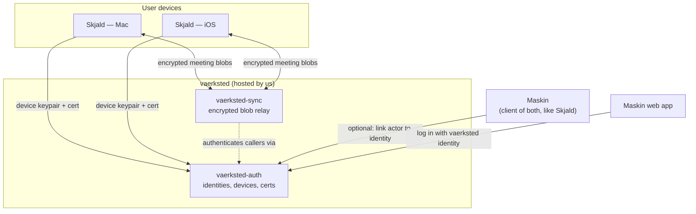
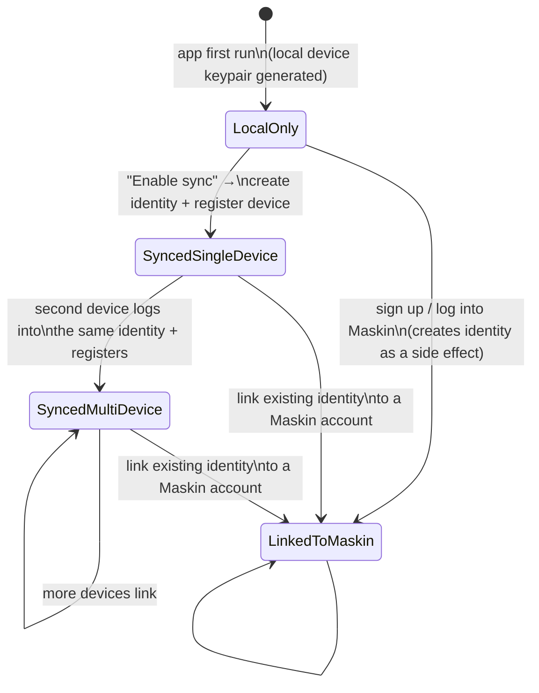

# Vaerksted Identity & Sync — Design Doc

Status: Proposal, not yet implemented
Owner: Magnus
Scope: Skjald device sync + cross-ecosystem login, built as standalone services hosted (for now) inside the Maskin monorepo
Implementation plan: [`vaerksted-auth-and-sync-implementation-plan.md`](./vaerksted-auth-and-sync-implementation-plan.md)

## 1. Context

Vaerksted is the umbrella for our apps. Today there are two:

- **Maskin** — multi-tenant, hosted by us. Users sign up directly; self-hosting is a possible future option for enterprise customers, not the default.
- **Skjald** — one Tauri codebase (Rust core + Next.js) that ships to macOS/Windows/Linux and iOS from the same source. Runs entirely on-device: local transcription, local storage, no required backend. `packages/auth`-equivalent code doesn't exist in Skjald today — there's a legacy `/get-profile` license check in `frontend/src-tauri/src/api/api.rs` pointed at `http://localhost:5167`, but that's the archived Python backend, not Maskin. There is currently no live connection between Skjald and Maskin.

We want:

1. Skjald devices (e.g. Mac + iPhone) to sync meetings with each other.
2. A login for Skjald that can also work as a Maskin login, so a user with a Maskin account doesn't create a second identity.
3. Neither of the above to require a Maskin account. Skjald must work fully offline with zero sign-in, and device-to-device sync must work for users who never touch Maskin at all.
4. The auth mechanism to double as a general handshake primitive for the ecosystem — including, eventually, agents authenticating the same way humans do (see §2).

Maskin already has a relevant asset: its `actors` table treats humans and agents as the same identity type, and `packages/auth` (`apps/dev`) already does password hashing + `ank_`-prefixed API keys via Hono middleware. That's useful precedent, but it's Maskin-specific plumbing, not something Skjald should depend on directly — see §4 for why identity has to live in its own schema.

## 2. Inspiration: block/buzz

[buzz](https://github.com/block/buzz) is a self-hosted workspace where humans and AI agents collaborate over a shared, signed event log. The part worth borrowing:

- **Identity is a keypair, not a password.** Every actor authenticates by signing a server-issued challenge (Nostr NIP-42/NIP-98), not by presenting a shared secret over the wire on every request.
- **Humans and agents are the same kind of principal.** No separate permission model for bots — an agent has its own keys and its own audit trail, scoped like a teammate.
- **Auth and audit are the same primitive.** The signature that proves identity is the same mechanism that signs every event, so "who did this" is never a separate system from "who is this."

We are **not** adopting Nostr or a relay-of-everything architecture — that's a much bigger bet than we need right now. We're borrowing the shape: **keypair-based device identity, challenge-response instead of bearer tokens, and a principal model that doesn't hard-code "human."** That shape is what makes "log in like NemID, but agents can do it too" a natural extension later instead of a rewrite.

## 3. Non-goals (v1)

- Full CRDT text-merge engine for concurrent transcript edits (see §9, open question).
- Enterprise self-hosted Maskin (separate effort; this design should not block it, see §10).
- Agent principals actually implemented (the identity model should not preclude this — see §5 — but this doc does not build it).
- Cross-org identity federation.
- **End-to-end encryption of synced content.** Decided 2026-08-08: TLS in transit + standard encryption at rest is the v1 trust model for vaerksted-sync — the relay is trusted the same way Maskin's own database already is, and can technically read synced content. This is a deliberate simplification (see §9) with a clear upgrade path if the zero-knowledge property becomes a product requirement later.

## 4. Core architectural decision: identity is its own service, not a Maskin feature

Maskin is multi-tenant and hosted by us, which removes the reason to make Maskin itself the identity provider (there's no "each org runs its own," so there's nothing to federate against). More importantly: **Skjald must be able to create an identity and sync devices without ever creating a Maskin actor.** If identity lived in Maskin's `actors` table, "sync without Maskin" would mean either duplicating the identity model or granting Skjald a Maskin actor it doesn't want. Neither is right.

So: identity and sync become their own logical services — **vaerksted-auth** and **vaerksted-sync** — with their own schema, own API, and no code-level dependency from Skjald or Maskin into their internals. Maskin becomes a *client* of vaerksted-auth, exactly like Skjald is. A Maskin actor gets an optional `vaerksted_identity_id` pointing at a vaerksted-auth identity; the reverse link never exists, because a vaerksted identity must be able to exist with zero Maskin actors attached to it.

**This generalizes beyond Maskin and Skjald.** Any future vaerksted app plugs into vaerksted-auth the same way: it becomes another client of the same public API (§6, §6a), optionally linking its own users to a `vaerksted_identity` the same way Maskin's `actors.vaerksted_identity_id` does, with no special-casing and no code-level dependency on vaerksted-auth's internals. Nothing in this design is Maskin-or-Skjald-specific — those two are simply the first two clients, not the shape of the system.

**Where they physically run, for now:** inside the Maskin monorepo/infra, as their own deployables (`apps/vaerksted-auth`, `apps/vaerksted-sync`), on their own Postgres schema, reachable only over HTTP/WS — never imported as TypeScript packages by Maskin's own routes. This is deliberately more setup than just adding tables to Maskin's existing DB, because that's the cost of making "spin it out later" a deployment change (move the container, repoint a URL) instead of an untangling project. Maskin's existing `packages/auth` (bcrypt passwords, `ank_` API keys) is untouched — it keeps authenticating Maskin's own API for machine/integration callers, orthogonal to human/device identity.



## 5. Identity model

```
vaerksted_identity
  id
  supabase_user_id    maps to Supabase Auth's auth.users.id (see §6a) — kept as its own
                       column rather than reused as this table's primary key
  email               nullable — an identity can exist before any email is attached
  created_at

device
  id
  identity_id         nullable — set only once sync is enabled and the device is linked (see §7)
  public_key          Ed25519, generated on-device, never leaves the device
  platform            'macos' | 'ios' | ...
  display_name        e.g. "Magnus's MacBook"
  created_at
  last_seen_at
  revoked_at           nullable

device_cert
  device_id
  identity_id
  issued_at
  expires_at           short TTL (see §6) — revocation propagates by non-renewal, not by push
  signature            vaerksted-auth's signature over (device_id, identity_id, public_key, expires_at)
```

`vaerksted_identity.id` is intentionally our own generated UUID, not Supabase's `auth.users.id` — `device`, `device_cert`, and Maskin's `actors.vaerksted_identity_id` (below) all reference *this* id, never Supabase's directly. Decided 2026-08-08: aliasing our primary key to Supabase's would mean every one of those foreign keys carries a Supabase-owned id, turning a future extraction (§10) into a primary-key migration across the whole schema instead of a one-column swap of what `supabase_user_id` points to.

A `device` is deliberately the generic principal, not `human_device`. The intent is that an **agent** can later be represented the same way — a `device`-shaped row with `platform: 'agent'`, admitted by a human identity's signature instead of a password login. Nothing in §6's handshake changes to support that; it's a consequence of not hard-coding "human" into the auth flow, per §2.

Maskin's linkage is one column: `actors.vaerksted_identity_id`, nullable, set when a user connects or creates their Maskin account via vaerksted auth. Maskin's own password/API-key auth is unaffected.

## 6. Auth protocol (the handshake)

1. **Device keygen — local, offline, always.** Every Skjald install generates an Ed25519 keypair on first run, stored in the OS keychain (Keychain on macOS, Secure Enclave-backed keychain on iOS). No network call. This key secures the local Tauri API regardless of whether sync is ever enabled.
2. **Enable sync** — the first point any network call happens:
   - New identity: `POST /identities` via whichever credential method the user picks (email + password, magic link, Google/Microsoft OAuth, enterprise SSO — see §6a for how these map onto vaerksted-auth).
   - Existing identity (this is also the Maskin-login-reuse path, see §8): `POST /sessions` with the same credential.
3. **Device linking:** authenticated by the session from step 2, the device sends its public key: `POST /devices` → vaerksted-auth issues a **device certificate**: `{device_id, identity_id, public_key, expires_at}` signed with vaerksted-auth's own signing key. The device stores this cert; the password/session token is not retained.
4. **Subsequent requests** (to vaerksted-sync, to Maskin, to another device directly) use challenge-response: the server sends a nonce, the device signs `{nonce, timestamp}` with its private key and presents the signature alongside its cert. The verifier checks the cert's signature (trusts vaerksted-auth's public key) and the request signature (trusts the device's public key from that cert). No bearer token is ever replayed as a standalone secret.
5. **Revocation:** mark `device.revoked_at`; certs are short-lived (proposal: 24h) so a revoked device is locked out within one TTL window even if a relay node cached its old cert. `POST /devices/:id/revoke` lets a user kill a lost device from any other linked device.

This is the SSH-CA / WebAuthn / Nostr-NIP-42 hybrid referenced in §2: vaerksted-auth is the certificate authority, devices are ephemeral signers, and nothing about steps 3–5 is human-specific.

**Invariant: an expired or missing device cert never restricts local-only functionality.** Cert expiry (step 5) only gates §9's sync/relay access and any Maskin-linked features — never recording, transcription, or viewing local meetings, since that would break Skjald's entire offline premise. This needs to be a hard rule, not just today's default: it's exactly the kind of thing that gets silently violated later by a code path that checks "is the cert valid" for consistency without asking whether it's gating something that was always meant to work offline. A device offline longer than the cert TTL simply can't sync until it reconnects and renews — nothing about its local operation changes.

## 6a. Credential providers (how step 2 is actually satisfied)

Steps 1–2 of §6 — "prove who you are, get a session" — can be satisfied by any number of methods: password, magic link, OTP, Google/Microsoft OAuth, enterprise SSO (Okta and friends), with or without MFA. None of it touches step 3 onward: device registration, cert issuance, sync, or Maskin linking (§8) all work identically regardless of which credential method produced the session. This section is only about how step 2 gets implemented, not a change to §5–§9.

**Backing implementation: Supabase Auth (GoTrue).** Rather than building password hashing, magic-link email delivery, OAuth callback handling, TOTP MFA, and SAML SSO ourselves, vaerksted-auth uses Supabase Auth as its credential-verification backend:

- A **new Supabase project dedicated to vaerksted-auth** — not Maskin's existing one. Keeps identity decoupled from Maskin per §4's core decision; if we ever move off Supabase, it's an isolated migration, not entangled with Maskin's database.
- Supabase Auth is internal plumbing, never something Skjald or Maskin talk to directly. Flow: client calls vaerksted-auth's own `POST /identities` / `POST /sessions`; vaerksted-auth calls Supabase Auth to actually verify the credential or complete the OAuth/SSO handshake; on success, vaerksted-auth mints its own session and proceeds to device-cert issuance (§6 step 3) exactly as already designed. This preserves the extraction seam from §10 — swapping the backing credential provider later doesn't change what Skjald or Maskin depend on.
- GoTrue (Supabase Auth's engine) is open source, so this isn't a one-way door if self-hosting it is ever needed.

**Identity linking policy: explicit, not automatic.** Supabase Auth's default behavior links a new sign-in to an existing user automatically when the email matches a verified account. Decided 2026-08-08: turn this off. Emails get reassigned (a company hands `alex@company.com` to a new hire after the previous one leaves) and different providers verify ownership with different rigor, so auto-linking on email match risks silently merging two different people into one identity — which is expensive to unwind once device certs and synced data are already hanging off it, unlike the schema concern above, which recovers cheaply. Instead: linking a second provider to an existing identity requires the user to be actively logged in and take an explicit action ("link your Microsoft account" in account settings), never an implicit merge triggered by a new signup matching an old email. This doesn't require our own `identity_credential`/linking table to enforce — it's a Supabase Auth configuration choice — and if we ever do want our own copy of that linking graph (e.g. at extraction time), it backfills cleanly from Supabase's `auth.identities` table, which is documented and stable.

**Priority order:**
1. **Now:** magic link, Google OAuth, Microsoft OAuth. Supabase Auth supports all three with minimal setup and covers the large majority of individual users.
2. **Soon after:** password as a fallback option for users who want one, not the primary path.
3. **Later, enterprise-driven:** Okta / generic SAML or OIDC SSO. Supabase supports SSO on higher-tier plans — build this when a specific enterprise deal requires it, not speculatively.
4. **Later:** TOTP MFA, optional or enforced per identity/organization.

**OAuth client vs. OAuth issuer — two different roles, worth keeping distinct:**
- *Client* role (now): vaerksted-auth delegates "who are you" to Google/Microsoft/Okta as upstream providers. Standard OAuth2 authorization-code + PKCE; Supabase Auth already implements this correctly, nothing for us to get wrong.
- *Issuer* role (later, §11 M6 territory): vaerksted-auth itself becomes an authorization server that other things — third-party integrations, and eventually agents per the Buzz-inspired vision in §2 — request scoped tokens from. This is where OAuth 2.1 actually applies to something we build: since there's no legacy client base to support, default to 2.1's tightened rules from day one (PKCE mandatory for every client, no implicit grant, no resource-owner-password-credentials grant) rather than shipping 2.0 semantics and retrofitting later.

**MFA and the device-cert flow.** Once MFA exists, the natural policy is step-up, not blanket enforcement: a login session can be MFA-verified or not, but issuing a *new* device certificate (§6 step 3) — the action that grants a device long-lived standing to an identity's synced data — should require a fresh MFA check regardless of whether the session that authorized it already had one, the same way most products ask for step-up auth before adding a payment method. Revoking a device (§6 step 5) remains the cheap, always-available escape hatch if this policy ever proves too strict in practice.

## 7. Skjald state machine



Key property: **`LocalOnly` has zero network dependency**, and reaching `SyncedSingleDevice` never requires passing through Maskin. `LinkedToMaskin` is an optional side-branch reachable from any synced state (or directly from local-only, if the user's first action is "sign up for Maskin"). This holds even after leaving `LocalOnly`: a device in any synced state that goes offline long enough for its cert to expire does **not** fall back to `LocalOnly` — per §6's invariant, it keeps full local functionality throughout and simply can't sync until it reconnects and renews.

## 8. Maskin login reuse

Because Maskin becomes a client of vaerksted-auth (§4), "log into Skjald with your Maskin account" and "log into Maskin with your Skjald identity" are the same operation: `POST /sessions` against vaerksted-auth. Maskin's sign-up flow, when the user chooses "continue with vaerksted," creates (or reuses) a vaerksted identity and then creates a Maskin actor with `vaerksted_identity_id` set — no second password. A user who already has a Maskin account and later enables Skjald sync just logs in with the same credential at step 2 of §6; a `device` row gets attached to their existing identity.

## 9. Sync protocol

**Content & conflict model.** Meetings are coarse-grained, mostly-append records (created once during/after a recording, occasionally edited afterward), not a live collaborative document. That argues against pulling in a full CRDT text-merge engine (Automerge/Yjs) for v1 — the concurrent-edit case is rare (two devices editing the same meeting's notes at the same moment) and the cost of getting it wrong is low (last write wins on a field, not silent data loss on a whole document). **Proposal: per-field last-write-wins, keyed by `(device_id, logical_clock)`**, at the granularity of a meeting record's fields (title, notes, tags — not sub-paragraph). Revisit if real usage shows frequent same-field concurrent edits.

**Encryption & trust model (v1).** No client-side/end-to-end encryption. Content travels over TLS and is stored at rest with standard database/disk encryption — the same trust model Maskin's own database already operates under. vaerksted-sync (the operator, i.e. us) can technically read synced content; nothing about the device-cert handshake in §6 changes, since that authenticates *who* is pushing/pulling, independent of whether the payload is further encrypted. This is a deliberate v1 simplification, not an oversight — see the upgrade path below.

**Relay responsibilities (vaerksted-sync):** accept `POST /sync/push` (blob + metadata: device id, meeting id, field, logical clock), fan out to online devices over a WebSocket, retain undelivered blobs for offline devices until acknowledged, `GET /sync/pull?since=<clock>` for reconnect/catch-up. It authenticates callers via device certs from vaerksted-auth (§6 step 4) — it does not run its own login flow.

**Maskin as a future sync participant.** If a user later wants Maskin (e.g. an agent) to read their Skjald meetings, that's a distinct, explicit opt-in — Maskin is granted read access to that identity's sync stream, same as any other authorized reader would be. It is not a side effect of linking a Maskin account (§8) — linking identity is not the same as sharing content, which keeps "you decide what you share" true by construction, not by policy.

**Privacy policy alignment (needed for M4).** Skjald's current published privacy policy (`PRIVACY_POLICY.md`) states unconditionally that meeting content is never transmitted externally. Decided 2026-08-08: reframe this as a choice the user makes, not a blanket guarantee — local-only stays the default and requires no account or network access, and a user who explicitly signs up and enables sync is choosing to transmit their meeting content to our infrastructure, which is EU-hosted regardless of which piece it touches (§10). The wording update ships alongside M4, not before — today's "never transmitted" is still accurate, since sync doesn't exist yet. Separately, on the controller/processor question this raises — meeting content includes other participants' personal data, not just the recording user's — the product already covers part of this: Skjald surfaces a consent notice at the start of every recording, prompting the user to inform other participants. What's still unresolved is the data-processing terms between us and our own users (distinct from our DPA with Supabase as our sub-processor) — see §12, needs real legal review before M4, not just an architectural decision.

**Future upgrade: end-to-end encryption.** If we later want "the relay cannot read your data" as a real product/security claim, the plan (discussed and deliberately deferred on 2026-08-08) is: generate a per-identity data encryption key (DEK) that encrypts content client-side before it reaches the relay, and wrap that DEK two ways so recovery matches normal login expectations — (1) to each linked device's public key, so day-to-day use never requires re-entering a password, and (2) to a key derived from the account password via a slow KDF (Argon2id), with only the *encrypted* DEK blob stored server-side, so logging into a brand-new device with just email + password recovers access without needing any prior device. The one sharp edge to design in up front when we get there: a "forgot password" reset that doesn't know the old password can't re-derive the old wrapping key, so that flow needs an explicit warning (or a separate recovery-phrase escape hatch) that resetting without the old password makes synced history unrecoverable.

## 10. Deployment & extraction plan

- **Phase 1 (this effort):** `apps/vaerksted-auth` and `apps/vaerksted-sync` deployed as separate containers inside Maskin's existing infra (Coolify/Docker Compose), own Postgres schema (or separate logical database — cheap to do now, expensive to retrofit). Explicitly not folded into `apps/dev`'s process, so scaling or extracting either service later is a deployment change, not a code change.
- **Hosting: EU by default, for everything.** Existing operating principle, not a new one introduced here — it's how Maskin already runs, and applies identically to vaerksted-auth and vaerksted-sync. Infrastructure we operate ourselves is self-hosted on servers located in the EU. For the handful of pieces we don't operate ourselves — currently Supabase (§6a) — we use them configured to host in the EU rather than a default region, the same way Maskin's existing Supabase usage already is. Any AI models called rather than self-hosted must likewise be EU-hosted, or self-hosted by us in the EU. Note: `maskin/.env.example`'s `S3_REGION` default of `us-east-1` is an example/placeholder value, not real deployment config — don't let the new services inherit it; confirm the actual region used for their storage/database is EU-based when they're stood up.
- **Phase 2 (if/when needed):** move to its own repo and infra with the same API contract; clients repoint a base URL. Nothing about §5–§9 changes.
- **Enterprise self-hosted Maskin** is orthogonal: an enterprise that self-hosts Maskin can still point at our hosted vaerksted-auth (simplest — Skjald sync keeps working the same way for their users) or run their own instance of vaerksted-auth too (more control, more ops burden on them). Either is possible because Maskin only ever talks to vaerksted-auth over its public API — decide this when an actual enterprise deal needs it, not now.

## 11. Rollout milestones

1. **M1 — Local device identity.** Skjald generates and stores its device keypair on first run. Ships independent of everything else; no server exists yet.
2. **M2 — vaerksted-auth service.** Identity signup/login, device registration + cert issuance, revocation. No product surface yet beyond a test client.
3. **M3 — Skjald "Enable sync" flow.** Wires the local keypair from M1 to M2: create/login identity, register device, store cert. Single-device only — no relay yet, just proves the handshake end-to-end.
4. **M4 — vaerksted-sync relay.** Push/pull of blobs over TLS, multi-device fan-out, retention for offline devices. This is what makes two Skjald devices actually sync.
5. **M5 — Maskin account linking.** "Continue with vaerksted" on Maskin's signup/login. Once vaerksted-auth exists, Maskin stops creating new native-password accounts — every new signup goes through vaerksted-auth. Existing native-password actors are *not* force-migrated in one event; they keep working as-is and become a bounded, shrinking population migrated opportunistically instead:
   - **Primary path — silent backend migration.** Check whether Supabase Auth's admin API can accept an existing bcrypt hash directly when creating a user (Supabase's own default hashing is bcrypt too, so this is plausible but unverified against Maskin's exact hash format/cost factor). If it works, migrating an actor is a background job with zero user-visible change: same email, same password, verification just moves from `actors.password_hash` to Supabase going forward.
   - **Fallback path — explicit claim flow.** If hash import isn't viable, a login attempt against an email that already has a Maskin actor triggers an email-verification step (magic-link-style) proving ownership, then links the two accounts. This is the explicit-linking policy from §6a applied retroactively rather than prospectively — not a new mechanism. The email carries over unchanged under this path; the password does not (unrecoverable from a hash), so the user sets a new one or moves to magic link/OAuth.
   - **Cleanup:** `packages/auth/src/middleware.ts` currently carries a `// Future: Better Auth session validation` comment describing a different, now-superseded plan for session-based human login. Update or remove it once M5 ships so it doesn't get picked back up as the plan.
6. **M6 (later, out of scope now) — Agent principals.** Extend `device` to agent-type principals admitted by a human identity's signature; Maskin registering as an opt-in synced device per §9.

## 12. Open questions

- **Relay storage costs.** vaerksted-sync is hosted by us for free (multi-tenant, like Maskin) — what's the retention/quota policy for undelivered blobs and revoked devices' backlog, to avoid unbounded storage growth per identity?
- **Field-level LWW vs CRDT** (§9) — revisit once we see real concurrent-edit frequency from usage, rather than pre-building for it.
- **Cert TTL tuning** (§6) — 24h is a placeholder; shorter improves revocation propagation speed, longer reduces re-auth network chatter for offline-heavy usage (a core Skjald scenario).
- **When does E2E encryption become a requirement** (§9)? Worth revisiting if: we start marketing a "we cannot read your meetings" privacy claim, an enterprise customer requires it contractually, or a security review flags the relay's plaintext access as unacceptable. Until then, TLS + at-rest encryption is the v1 answer.
- **Data-processing terms with our own users, not just with Supabase.** EU hosting (§10) resolves *where* data lives; it doesn't resolve the contractual relationship for meeting content that includes other meeting participants' personal data, not just the recording user's. Needs real legal/DPO review before M4 ships — likely an addition to Terms of Service — not something this doc can settle architecturally.
